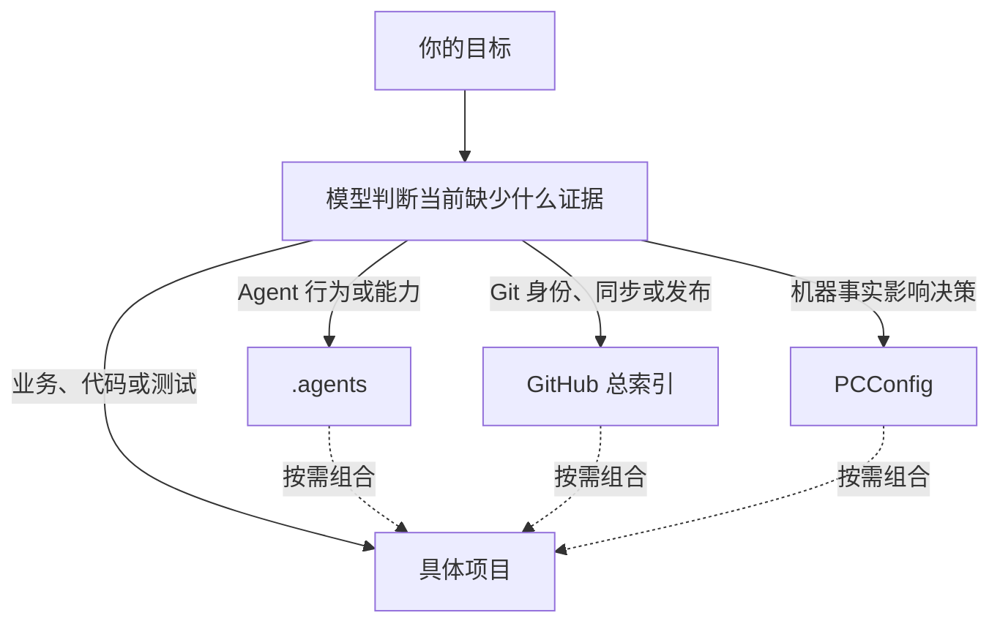

# 我的 GitHub 项目管理指南

> 面向用户的产品与设计说明｜更新：2026-07-13（中国时间 UTC+8）

GitHub 总索引把这台电脑上分散的 Git 仓库变成可查询的公开安全视图：项目在哪里、远端和可见性是什么、分支与 worktree 状态怎样，以及准备发布时应关注哪些风险。它是能力和证据来源，不是每个项目任务必须逐站通过的流水线。

## 1. 四个 owner 是按问题分派，不是线性审批链



- `E:\.agents` 拥有 AI 行为、skills/plugins 与跨项目能力路由。
- `E:\GitHub总索引` 拥有仓库身份、远端、可见性、同步诊断和公开发布边界。
- `E:\PCConfig` 拥有路径迁移、计划任务、端口、运行时、本机数据与恢复事实。
- 具体项目拥有业务语义、源码、项目规则、启动、测试和部署方式。

模型依据任务耦合度、风险、证据新鲜度和调用成本选择一个或多个 owner。比如，错误日志里出现 `E:\Projects\...` 不代表决策依赖机器配置；只有需要判断路径是否已迁移、任务 Action 是否正确、端口由谁占用或怎样恢复时，PCConfig 才提供实质信息。

### 以后新仓库放在哪里

- 四大基座和现有 `E:\Projects\...` 仓库保持原位，不为目录统一批量迁移。
- 新建或新 clone 的个人 Git 仓库默认放在 `V:\Dev\Personal\Projects\...`；个人临时 worktree 默认放在 `V:\Dev\Personal\Worktrees\...`。
- 未来工作仓库和 worktree 分别使用 `V:\Dev\Work\Projects\...` 与 `V:\Dev\Work\Worktrees\...`；这只是组织边界，不替代公司设备或合规隔离。
- 总索引记录实际存在的仓库路径，不把默认目录或空目录提前登记成仓库。若项目不兼容 ReFS、要求特定恢复方式或另有项目规则，以专项证据为准。
- `Z:` 是可丢缓存层，不放 Git 仓库。

## 2. 总索引解决什么问题

项目多以后，常见风险是把旧路径当现状、混淆同名仓库、误判 public/private、忽略其他 worktree，或把“Git 可以 push”误解为“内容可以公开”。本仓库提供三类能力：

- 公开索引和同步快照，便于人快速发现值得关注的仓库；
- 结构化 provider，便于模型在需要时取得单仓库新鲜事实；
- 公开发布规则，明确哪些结果可以进入公开目标。

它不拥有项目代码，不替代项目测试，也不要求每次普通 commit 都生成控制面记录。

## 3. Admission provider 是可选证据能力

`tools\Get-ProjectAdmission.ps1` 输出 `github-local-index.project-admission.v1`，可解析：

- 本地仓库路径、Git 根、remote 和 GitHub identity；
- visibility、当前分支、默认分支与 upstream；
- 全部 worktree 的 staged、unstaged、untracked、conflicted 状态；
- ahead、behind、diverged、no-upstream 等 transport 条件；
- cached 或 live 的证据新鲜度。

它在以下情况通常有高信息价值：

- 同名目录、remote 或仓库身份可能混淆；
- 要依赖当前 worktree/sync 状态选择安全操作；
- visibility 或推送目标不明确；
- 多仓库批处理需要统一结构化字段；
- 旧索引与当前 Git 证据可能冲突。

如果当前 `.git`、remote、visibility 和候选差异已经通过新鲜可靠证据明确，模型可以直接使用这些证据，不为流程完整性重复调用 provider。

provider 的结论需要按边界解释：

- `decision` 表示 provider 是否取得足够的项目进入证据；`block` 应停止基于该证据的写入和直接 transport，但只读诊断可以继续。
- `push_decision` / `push_strategy` 只描述 Git transport readiness。
- V1 不提供 `publication_decision`，也不授予外部写入。
- cached、unknown 或冲突结果要结合风险决定补充什么证据，不能自动当成安全或失败的全部结论。

需要时可运行：

```powershell
pwsh -NoProfile -File E:\GitHub总索引\tools\Get-ProjectAdmission.ps1 `
  -Repo wlyaaaaa/github-local-index -Fetch -Json
```

## 4. Transport 与 publication 必须分开

Git remote 可达、分支 ahead、工作区干净，只能说明 transport 条件。对 `PUBLIC` 目标，真正的发布判断还依赖：

- 当前新鲜 visibility，而不是旧记忆；
- 实际候选 commits 与 paths；
- 候选内容是否含凭据、隐私、原始日志、截图、机器快照或可滥用运维细节；
- 目标项目规则与用户当前授权。

对确认仍为 `PRIVATE` 的备份、恢复、个人知识库或配置快照，应保留任务需要的精确内容，不因看到 token 或私钥就自动破坏备份。目标可信与外部写入授权是两个不同问题。

`wlyaaaaa/Key` 是明确例外：只记录公开安全的远端私有备份状态，禁止本机 clone、展开、恢复或计划任务建议。

完整矩阵只维护在 [推送放行与否决规则](05_规则与模板/推送放行与否决规则.md)，避免四份文档复制后漂移。

## 5. 目录与能力地图

| 路径 | 内容 | 使用方式 |
|---|---|---|
| `00_总览/` | 全局看板 | 人类导航和趋势观察 |
| `01_仓库索引/` | GitHub 仓库与本地 clone | 快速定位，不替代当前 Git 事实 |
| `02_同步诊断/` | 分支、远端、脏状态与同步问题 | 发现候选问题 |
| `03_推送决策/` | 公开安全的里程碑记录 | 只在有长期价值时更新 |
| `04_计划任务/` | 可公开的自动化健康摘要 | 不拥有完整 Action/trigger/XML |
| `05_规则与模板/` | 发布和脱敏规则 | 准备公开结果时参考 |
| `docs/contracts/` | owner-local 稳定机制卡 | 机制、兼容或故障任务按需读取 |
| `90_历史审计/` | 历史证据 | 不代表当前状态 |
| `99_private/` | 本机原始材料 | Git ignored，禁止进入公开仓库 |

结构化 provider 与当前 Git 命令适合做机器判断；生成 Markdown 适合人类总览。历史快照有观察时间，不能取代当前证据。

## 6. 维护和刷新

需要更新总索引的典型事实变化包括：

- 仓库新增、删除、改名、remote 或 visibility 改变；
- clone 路径迁移、默认分支或长期同步策略改变；
- worktree/admission 的稳定语义改变；
- 公开门禁升级或用户要求记录重要里程碑；
- 生成快照确有需要重建。

通常不需要更新：

- 普通功能、bugfix 或文档 commit；
- 只有项目业务内容改变；
- 为了让三个控制面在同一天各产生 commit；
- 已有新鲜证据，却只想重复跑一遍工具确认仪式完成。

主要维护工具：

- `Get-ProjectAdmission.ps1`：按需单仓库结构化取证。
- `Update-GitHubIndex.ps1 -SkipFetch -NoWrite`：预览生成结果。
- `Update-GitHubIndex.ps1`：确需时重建公开快照。
- `Test-GitHubLocalIndexConsistency.ps1`：诊断索引漂移。
- `Add-PushRecord.ps1`：幂等写入明确里程碑，不执行 Git 操作。
- `Install-GitHook.ps1`：首次 bootstrap 或修复防泄漏 Hook。

Fast refresh 仍为旧调用方保留兼容，但不是日常收尾推荐入口。Hook 也是 defense in depth：它能拦截部分显著模式，不能证明未命中的内容适合公开，且无需每任务重装。

## 7. 公开安全模型

本仓库是 `PUBLIC`。禁止进入 Git 历史的内容包括真实 API key/token/私钥、完整 `.env` 或 OAuth JSON、原始日志/数据库/聊天/健康资料、私密截图、未缩减机器快照、完整任务 XML，以及能直接造成滥用的运维细节。

可以公开的内容包括公开仓库 identity、remote、分支与同步摘要，不复制值的风险结论，以及经过缩减和脱敏的问题分类、发布决定与治理规则。

公开扫描发现疑似暴露时，先缩小候选差异、确认目标可见性和内容语义。安全来自对实际候选结果的判断，不来自是否运行过某个固定脚本。

## 8. 常见误区

### “有 provider 就应该每次调用”

不需要。provider 是高质量结构化证据源；它的价值取决于当前不确定性。已经有等价的新鲜证据时重复调用只增加延迟和上下文。

### “admission block 后什么都不能做”

不对。它应阻止依赖不充分身份/同步证据的写入和直接 transport，但只读检查正是定位 block 原因的方式。

### “transport proceed 就能公开”

不对。公开发布必须审查当前 visibility 和实际候选 commits、paths、content。

### “私有仓库出现秘密就必须脱敏”

不一定。确认目标仍为 `PRIVATE` 且任务是备份或恢复时，精确保真比形式脱敏更重要；但不得把内容复制到公开索引或聊天中。

### “出现本机路径就要加载 PCConfig”

不对。只有当前决定依赖路径、任务、端口、运行时、迁移或恢复事实时，PCConfig 才是相关 owner。

### “每次 push 都要写总索引记录”

不需要。只有 owner 事实变化或明确里程碑才值得形成公开记录。

## 9. 设计原则

总索引的最优形态不是更长的流水线，而是少量可靠能力：需要时能迅速获得高价值 Git 证据，准备公开时能守住真实暴露边界，其余判断交给顶级模型结合项目上下文完成。新规则应减少重复事实和固定仪式，只在真实故障、泄漏复盘、接口变化或新的治理需求出现时扩展。
