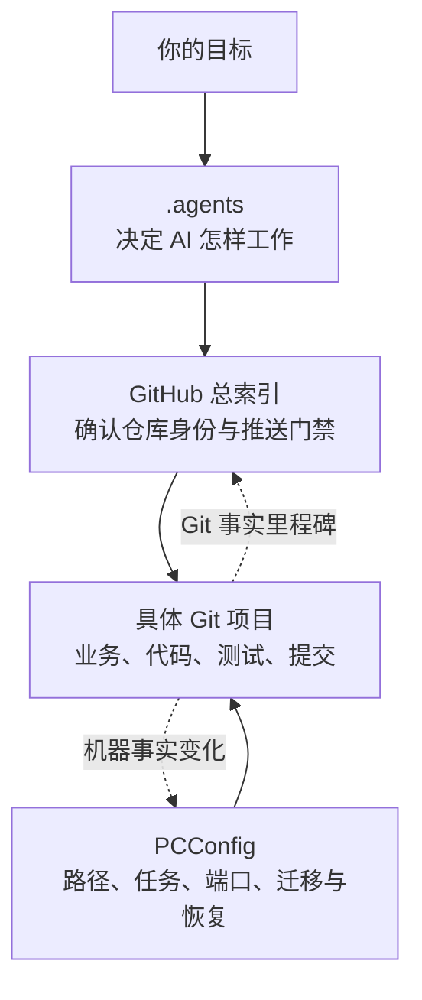
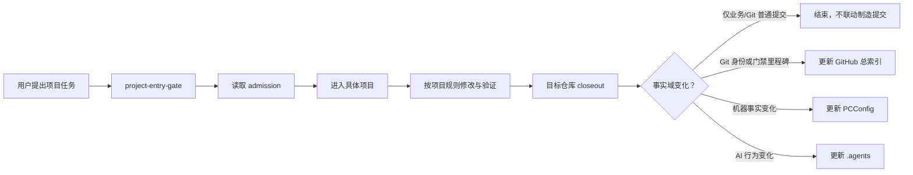

# 我的 GitHub 项目管理指南

> 面向用户的完整说明｜更新：2026-07-10（中国时间 UTC+8）

这份文档解释 `E:\GitHub总索引` 的完整设计、功能和日常用法。它不是给 AI 每次开工都全文读取的规则堆，而是给你理解系统、发现问题、产生新想法和三个月后重新评审时使用的产品说明书。

AI 提示：只有在向用户解释 Git 项目治理、做架构评审、入门、维护公开索引设计或更新本文档时完整读取。普通项目任务直接运行 admission/fast-path 工具并读取目标项目规则。

## 1. 一句话理解 GitHub 总索引

GitHub 总索引是这台电脑所有 Git 项目的事实入口和公开发布门禁。它把“项目在哪里、远端是什么、是否公开、当前分支和同步状态怎样、能不能推送”变成可查询证据。

它不是项目代码集合，也不是把所有仓库复制到一个大仓库。每个项目仍在自己的目录和 Git 仓库中，保留自己的业务、历史、分支、测试和远端。

## 2. 为什么需要总索引

项目数量增加后，最危险的不是找不到代码，而是判断错仓库身份和发布边界：

- 本地目录可能已迁移，但旧文档仍写着原路径；
- 私有备份仓库和公开项目的安全规则完全不同；
- 工作区可能有用户未提交改动；
- 当前分支可能不是远端默认分支；
- ahead/behind、多个 worktree 或脏状态会改变安全操作方式；
- 一次普通 push 不应该自动触发另外两个控制面仓库制造提交。

总索引让 AI 和你在进入项目之前先取得同一组 Git 事实，再决定下一步。

## 3. 三个控制面怎样联动



- `E:\.agents` 拥有 AI 行为、skills、plugins 和跨项目协作规则；
- `E:\GitHub总索引` 拥有 Git 仓库身份、远端、可见性、分支、同步和公开门禁；
- `E:\PCConfig` 拥有本机路径、任务、端口、运行时、迁移和恢复事实；
- 具体项目拥有业务语义、源码、启动方式、测试和项目专属规则。

项目文件夹永远是项目自己的文件夹，不迁入 GitHub 总索引或 PCConfig。

## 4. 总索引有哪些功能

### 4.1 项目 admission

`tools\Get-ProjectAdmission.ps1` 是进入一个 Git 项目前的首选查询。它解析：

- 本地仓库路径和 Git 根；
- GitHub owner/repo 和可见性；
- 当前分支与远端默认分支；
- ahead、behind、diverged、in-sync、no-upstream 和 detached 状态；
- 主工作区及其他 worktree；
- 每个 worktree 的 `dirty_summary`（staged、unstaged、untracked、conflicted）与兼容总数 `dirty_count`；
- cached 或 live 证据模式；
- 只读进入项目的 `decision`，以及直接推送的 `push_decision` / `push_strategy`。

示例：

```powershell
pwsh -NoProfile -File E:\GitHub总索引\tools\Get-ProjectAdmission.ps1 `
  -Repo wlyaaaaa/github-local-index -Json
```

```text
decision=block => no write or push
decision!=block && push_decision!=proceed => read-only diagnosis allowed, direct transport blocked
push_decision=proceed => transport conditions only
visibility=PUBLIC => separate publication review of rules, visibility, commits, paths and content
```

admission 是只读门禁，不会替你改分支、提交或推送。behind 或 diverged 仍可只读进入并诊断，但直接 transport 被阻止，分别要求 `update_then_recheck` 或 `reconcile_then_recheck`。脏工作区、无 upstream、cached 证据会给出 warn 和对应策略。即使 `push_decision=proceed`，它也只证明 transport readiness；admission V1 不输出 `publication_decision`，PUBLIC 目标必须另查项目规则、visibility、候选 commits、paths 与 content。

### 4.2 公开仓库与本地 clone 索引

`01_仓库索引\` 记录 GitHub 仓库、本地 clone 和未发现本地 clone 的公开安全清单。它适合人类总览；自动决策应优先使用 admission 的当前结构化输出。

路径用于定位项目，但路径迁移与机器依赖的详细事实由 PCConfig 拥有。

### 4.3 同步诊断

`02_同步诊断\` 汇总分支、远端、未推送、脏工作区、云端备份和本机配置状态。它回答“有哪些项目值得关注”，但生成时间之后发生的变化不会自动写回历史快照。

### 4.4 推送放行与否决

总索引把不同仓库分成不同安全策略：

- 公开索引仓库：只能提交公开安全的文档、规则、摘要和脱敏结论；
- 公开业务仓库：按项目规则审查源码、日志、截图、绝对路径和临时产物；
- 私有备份仓库：在确认仍为 `PRIVATE` 后，以可恢复性为优先；
- `wlyaaaaa/Key`：只记录远端私有备份状态，严格禁止本机 clone。

“私有仓库可能含秘密”不等于默认拒绝推送；“仓库曾经私有”也不等于永远安全。每次敏感备份推送都应确认当前 visibility。

### 4.5 推送决策记录

`03_推送决策\` 保存公开安全的已推送、否决和需人工确认摘要。它是里程碑记录，不是每个 commit 的流水账。

`tools\Add-PushRecord.ps1` 只负责幂等写文件，不会 stage、commit、pull、rebase 或 push。普通项目小任务默认只收尾目标仓库，不调用它。

### 4.6 计划任务公开健康摘要

`04_计划任务\` 只显示可以公开的健康状态、异常和自动化治理建议。它不保存完整 task XML、敏感 Action 或恢复参数。

真实分工是：

- Windows Task Scheduler：实时运行状态；
- PCConfig：机器配置与恢复事实；
- 所属项目：任务的业务语义和注册脚本；
- GitHub 总索引：公开安全的健康摘要。

### 4.7 公开发布规则与模板

`05_规则与模板\` 定义公开发布脱敏、推送放行/否决和审计报告格式。它避免每个 AI 按自己的直觉重新发明安全标准。

Git 控制面的五张 owner-local 合同白盒位于 [`docs/contracts/`](./docs/contracts/)；它们只保存稳定机制与证据入口，动态事实仍由 admission、refresh 和 milestone helper 在任务当下提供。

### 4.8 一致性与刷新

总索引提供不同成本和写入效果的检查：

| 路线 | 用途 | tracked Markdown | 其他写入效果 |
|---|---|---|---|
| Admission | 单仓库开工事实 | 不重建 | 默认 cached 查询不写；`-Fetch` 会更新 Git 远端证据 |
| Fast path | 单仓库收尾快查 | 不重建 | 可能写本机 private log |
| CheckOnly / consistency | 判断公开索引是否漂移 | 不重建 | 使用并清理 system temp |
| Full refresh | 确实需要重建公开摘要 | 重建 | 按刷新流程产生派生材料 |

普通任务使用前两种。Fast 与 CheckOnly 都不是 `zero_write`；只有索引事实、公开门禁或明确里程碑发生变化时，才做完整刷新。

## 5. 一个项目怎样从开工到收尾



### 开工

1. `.agents` 的 `project-entry-gate` 确认任务属于 Git 项目；
2. 查询总索引 admission，核对路径、remote、visibility、分支和脏状态；
3. 涉及本机路径、计划任务、端口、恢复或迁移时，同时查询 PCConfig；
4. 进入具体项目并读取最近的 `AGENTS.md`、README 和测试入口；
5. 保留用户已有改动，必要时使用 worktree 隔离。

### 实施

项目自己的规则决定功能设计、测试、提交范围和发布方式。总索引不替代项目规则，也不会因为项目在索引里就自动获得推送许可。

### 收尾

1. 只 stage 本次目标文件；
2. 运行与风险匹配的验证和公开安全扫描；
3. 提交并推送目标仓库；
4. 检查 branch、commit hash、remote 和同步状态；
5. 只有 owner 事实确实变化时才联动更新对应控制面。

## 6. 什么时候更新总索引

需要更新：

- 仓库新增、删除、改名或 remote 改变；
- 本地 clone 路径迁移；
- public/private 可见性改变；
- 默认分支或长期推送策略改变；
- worktree/admission 口径改变；
- 公开门禁规则升级；
- 用户明确要求记录一个重要里程碑。

通常不更新：

- 普通功能 commit 或文档小修；
- 只有具体项目业务内容变化；
- 没有可公开事实变化的私有备份；
- 只是为了让所有仓库在同一天各产生一个 commit。

这就是“联动更新”与“联动噪音”的区别。

## 7. 目录地图

| 路径 | 主要读者 | 内容 |
|---|---|---|
| `README.md` | 人和 AI | 简短入口 |
| `我的 GitHub 项目管理指南.md` | 用户 | 完整产品与设计说明 |
| `AGENTS.md` | AI | 执行规则和安全边界 |
| `00_总览\` | 用户 | 总体看板 |
| `01_仓库索引\` | 用户/AI | 仓库与 clone 清单 |
| `02_同步诊断\` | 用户/AI | 分支、远端、脏状态和同步问题 |
| `03_推送决策\` | 用户 | 里程碑式推送决定 |
| `04_计划任务\` | 用户 | 公开安全的自动化健康摘要 |
| `05_规则与模板\` | AI/用户 | 发布和脱敏门禁 |
| `90_历史审计\` | 用户 | 历史证据，不代表当前状态 |
| `99_private\` | 本机 | 被 Git 忽略的私有原始材料 |

## 8. 公开安全模型

本仓库是 `PUBLIC`。不能因为路径在本机、文件已被 Git ignore 或内容只出现一次，就认为可以公开。

禁止提交：

- API key、token、私钥值、完整 `.env` 和 OAuth JSON；
- 原始日志、数据库、聊天内容、健康资料和私密截图；
- 未脱敏机器快照、账号配置和可直接滥用的运维细节；
- `99_private\` 中的任何原始材料。

可以公开：

- 仓库名称、公开 remote、公开分支和同步摘要；
- “某私有备份包含凭据材料”这种不复制值的事实；
- 脱敏后的问题分类、放行/否决原因和治理规则。

公开安全扫描失败时停止提交和推送，不用“反正只是个人项目”绕过。

## 9. 分支与清理策略

三个控制面仓库统一使用 `main` 作为默认分支，减少未来 pull、恢复和 AI 判断分支。无用途的历史远端分支可以在确认不含未合并价值后删除；不要让一次性分支长期增加判断成本。

普通项目仍服从自己的分支策略。Codex 创建新工作分支时默认使用 `codex/` 前缀，但用户明确授权直接 `main` 时可按授权执行。

## 10. 常见误区

### “总索引应该包含所有项目细节”

不应该。项目细节属于具体项目；复制过来会过期并增加 AI 上下文。总索引只保存进入和发布所需的 Git 事实。

### “每次 push 都应该写一条总索引记录”

不应该。这样会产生控制面连锁提交。只有里程碑或索引事实变化才记录。

### “私有仓库里的秘密必须脱敏后备份”

不一定。私有备份的目标是可恢复，但推送前必须确认仓库仍为 `PRIVATE`，且秘密不能在聊天或公开索引中展开。

### “索引报告显示干净，所以项目现在一定干净”

不一定。报告有观察时间；开工使用 admission 获取当前证据。

### “计划任务列在这里，所以这里拥有任务配置”

不是。这里仅有公开健康摘要，真实配置与恢复由 Task Scheduler 和 PCConfig 管理。

## 11. 当前架构评价

对个人电脑和个人 GitHub 账户，这套总索引已经完善：单仓库 admission、worktree 感知、公开/私有分流、快路径收尾、幂等里程碑记录、公开安全门禁和控制面 owner 分工都已明确。

“完善”不等于把更多内容塞进来。现在最优策略是稳定使用，在事实变化时小范围更新，而不是继续增加 dashboard、重复 registry 或自动化提交链。

未来值得改变的触发只有：

- GitHub/Codex 官方能力或插件接口真实变化；
- admission 无法表达新的 Git/worktree 场景；
- 出现一次真实的公开泄漏或误推送复盘；
- 仓库规模增长到现有索引性能明显不足；
- 你产生新的项目治理需求，现有设计无法回答。

## 12. 三个月稳定期

接下来三个月不再进行重复架构评审。只读控制面检查负责发现明显漂移；没有真实故障、安全问题、官方能力变化或 owner 事实变化时，不扩建、不重写、不为“看起来更完整”制造提交。

你平时只需要记住：项目开工先查 admission，项目规则在项目自己内部，机器事实去 PCConfig，AI 行为去 `.agents`，普通 push 不自动拖着另外两个仓库一起提交。
